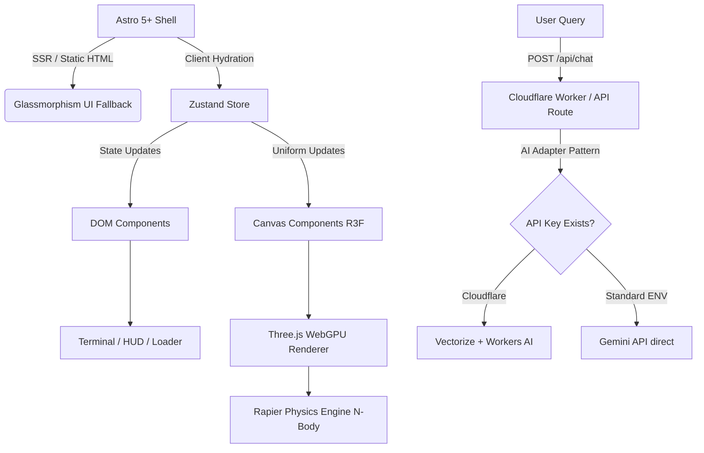

# Architectural Blueprint

This document outlines the core architecture for the "God-Tier" WebGL Portfolio, employing an **HFT Orbital Command** paradigm.

## System Architecture

We utilize a hybrid-rendering approach optimized for spatial computing and edge AI.

## Core Pillars

1. **Astro 5+ Hybrid Routing:**
   - Astro handles the overall document structure. The `/fallback` route provides a perfect, zero-JS HTML/CSS resume for ATS scanners and users with disabled WebGL.
   - The main `/` route hydrates the React 19 application.

2. **React Three Fiber (v9) & WebGPU:**
   - R3F manages the 3D scene graph. We strictly decouple the DOM from the Canvas to prevent React reconciliation from dropping frames.
   - We use the experimental Three.js WebGPU backend and TSL (Three Shading Language) for maximum performance.

3. **Physics (Rapier):**
   - `@react-three/rapier` governs the N-body gravitational simulation for the Orbital Command paradigm. 

4. **Edge AI Adapter Pattern:**
   - For elite deployments, Cloudflare Workers handles embeddings and RAG via Vectorize and D1 to achieve sub-50ms TTFT (Time To First Token).
   - For open-source forkability, an adapter gracefully degrades to calling the Gemini REST API if standard `.env` keys are used instead of Cloudflare bindings.

5. **Test-Driven Development (TDD):**
   - All core logic, config parsing, and AI endpoints are tested using Vitest before integration into the UI.
