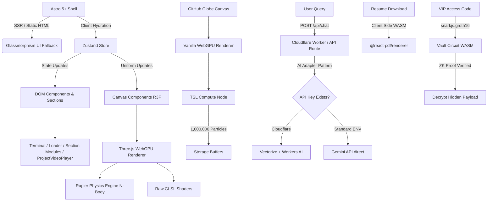

# Architectural Blueprint

This document outlines the core architecture for the High-Performance WebGL Portfolio, employing an **HFT Orbital Command** paradigm.

## System Architecture

We utilize a hybrid-rendering approach optimized for spatial computing and edge AI.

## Core Pillars

1. **Astro 5+ Hybrid Routing:**
   - Astro handles the overall document structure. The `/fallback` route provides a perfect, zero-JS HTML/CSS resume for ATS scanners and users with disabled WebGL.
   - The main `/` route hydrates the React 19 application.

2. **React Three Fiber (v9) & WebGPU:**
   - R3F manages the 3D scene graph. We strictly decouple the DOM from the Canvas to prevent React reconciliation from dropping frames.
   - We use the experimental Three.js WebGPU backend and TSL (Three Shading Language) for maximum performance.

3. **Physics (Rapier):**
   - `@react-three/rapier` governs the N-body gravitational simulation for the Orbital Command paradigm. 

4. **Isolated WebGPU Context (Phase 8):**
   - We utilize a bleeding-edge architectural pattern by segregating our canvas elements. The main portfolio operates on robust WebGL2 for physics compatibility. 
   - A highly isolated `<GitHubGlobe client:only="react" />` component spawns a secondary vanilla `WebGPURenderer` to execute mathematically intense TSL (Three Shading Language) Compute Shaders on 1,000,000 parallel vertices without blocking the main WebGL thread. 

4. **Edge AI Adapter Pattern:**
   - For production deployments, Cloudflare Workers handles embeddings and RAG via Vectorize and D1 to achieve sub-50ms TTFT (Time To First Token).
   - For open-source forkability, an adapter gracefully degrades to calling the Gemini REST API if standard `.env` keys are used instead of Cloudflare bindings.

5. **Phase 6 Advanced Performance Enhancements:**
   - **TSL WebGPU Shaders:** We explicitly avoid R3F main-thread bottlenecks by utilizing Three Shading Language (TSL) uniforms modified inside `useFrame` for Audio-Reactive WebGPU physics.
   - **Client-Side WASM PDFs:** We utilize `@react-pdf/renderer` for zero-latency, edge-free PDF generation.
   - **Focus Mode Frameloop Control:** The WebGPU canvas gracefully suspends via `frameloop="never"` bound to Zustand, preventing background battery drain.

6. **Component Modularity (Phase 7):**
   - We strictly adhere to single-responsibility files inside `src/components/sections/` for layout orchestration, ensuring ease of customization and maintaining SSR performance.

7. **Test-Driven Development & CI/CD (Phase 5):**
   - **Unit Testing:** All core logic, config parsing, and AI endpoints are tested using Vitest before integration into the UI.
   - **E2E Testing:** Playwright drives a headless Chromium browser to verify WebGL mounting and terminal interactions.
   - **CI/CD:** GitHub Actions triggers on every push, runs tests, builds the Astro Cloudflare output, and deploys directly to Cloudflare Pages globally.

8. **Zero-Knowledge Cryptography (Phase 8):**
   - A dedicated `ZKVault.tsx` executes mathematically rigorous Groth16 proofs natively in the browser via `snarkjs` and Circom. This guarantees a locked section of the portfolio cannot be brute-forced or intercepted.

---
## Phase 9 God-Tier Upgrades (Latest Updates)
- **3D Rigged Abstract Avatar**: Built a robotic digital twin using Three.js primitives (`Box`, `Sphere`). Implemented `Quaternion.slerp` for smooth 3D cursor tracking and Web Audio API integration for dynamic jaw lip-syncing.
- **WebGPU GitHub Globe Enhancements**: Replaced `PlaneGeometry` with 3D `TetrahedronGeometry` to prevent particles from disappearing during edge-on rotations. Rewrote the TSL compute shader to use an immutable base buffer for flawless, continuous oscillation without math locking.
- **Dynamic CSS Theme Sync for WebGL**: Implemented a `MutationObserver` inside the WebGPU initialization to dynamically read DOM CSS variables (like `--color-primary`), updating the Globe's color and swapping `AdditiveBlending` for `NormalBlending` in Light Mode to preserve visibility.
- **Interactive Terminal & Hidden Minigame**: Transformed the Gemini-Lite Terminal into an interactive input CLI. Typing `sudo play` mounts a hidden WebGL Physics Gravity Well Sandbox powered by `@react-three/rapier`, generating 150 blocks magnetically attracted to the user's cursor.
- **ZK-Vault Refinements**: Fixed JSX ternary logic errors, migrated all hardcoded color classes to CSS theme variables, and added native keyboard `Enter` key support.
