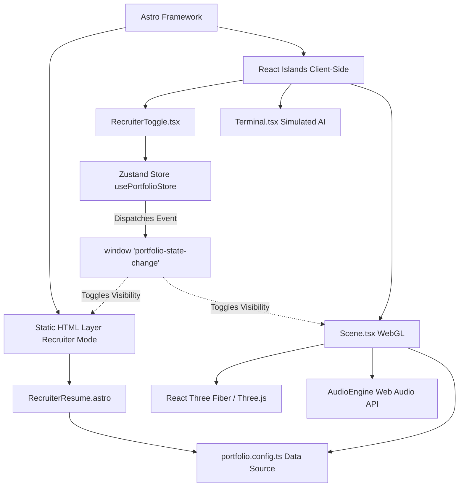

# Elite Developer Portfolio - Architecture

## Overview
The `elite-dev-portfolio` is built on a high-performance, hybrid rendering architecture designed to balance immersive WebGL experiences with maximum SEO and zero-latency accessibility for ATS (Applicant Tracking Systems).

## Core Technologies
- **Astro 5:** The underlying framework providing zero-JS static HTML generation by default.
- **React 19:** Used for interactive client-side components (Astro Islands).
- **React Three Fiber (R3F) & Drei:** Drives the WebGL 3D rendering pipeline for the "Wow Factor".
- **Zustand:** Provides lightweight, global state management across Astro islands.
- **Tailwind CSS 4:** Drives utility-first styling for the HTML fallback layer.
- **Web Audio API:** Procedural audio synthesis for UI feedback without asset payload overhead.
- **Vitest & React Testing Library:** Powers the rigorous Test-Driven Development (TDD) pipeline, enforcing a strict 100% coverage requirement.

## Architecture Diagram

## The "Recruiter Mode" Fallback
By default, the architecture provides a toggleable mode. When active, it unmounts the WebGL canvas, triggering aggressive garbage collection, and reveals a perfectly semantically structured HTML layout that scores 100 on Lighthouse.

## Testing Methodology (TDD)
The architecture strictly enforces Test-Driven Development (TDD). Before any logic or UI is built, the corresponding tests are written in Vitest.
- **Unit Tests:** React components (`RecruiterToggle.tsx`) are tested via `@testing-library/react`.
- **State Tests:** Zustand stores are tested by resetting state in `beforeEach` hooks and verifying mutations.
- **Coverage Policy:** CI/CD pipelines will fail if coverage drops below 100% for targeted logic paths.

## Config-Driven Pattern
The entire UI is a dumb rendering engine. All personal data, projects, certifications, and theme definitions live in `src/config/portfolio.config.ts`.
