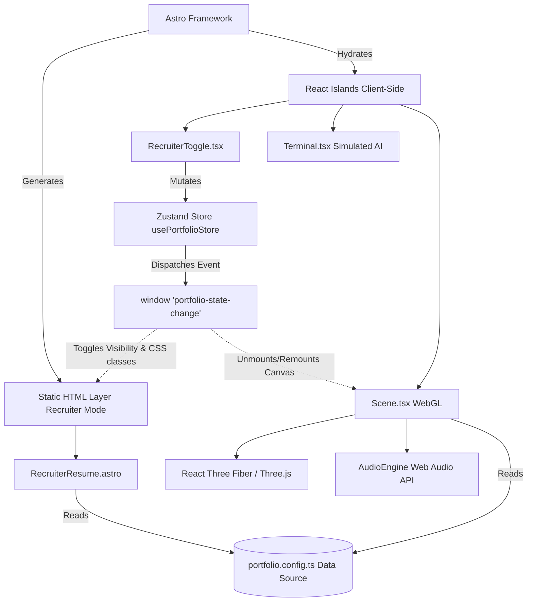

# Elite Developer Portfolio - Architecture

## 1. Executive Summary
The `elite-dev-portfolio` is built on a high-performance, hybrid rendering architecture designed to balance immersive WebGL experiences with maximum SEO, ATS (Applicant Tracking Systems) accessibility, and absolute zero-latency for corporate recruiters.

By leveraging an Astro-first approach, we serve static HTML instantly while progressively enhancing the user experience with React 19 Islands and React Three Fiber (R3F).

## 2. Core Technology Stack
- **Astro 5:** The underlying meta-framework. Responsible for routing, layout structuring, and generating zero-JS static HTML payloads by default.
- **React 19:** Powers the interactive client-side components (Islands) where complex state and lifecycle methods are required.
- **React Three Fiber (R3F) & Drei:** Drives the WebGL 3D rendering pipeline, enabling the immersive "Wow Factor" gallery.
- **Zustand:** Provides highly optimized, flux-like global state management across isolated Astro islands without the overhead of React Context providers wrapping the entire app.
- **Tailwind CSS 4:** Drives utility-first styling for the HTML fallback layer, ensuring rapid design iteration and minimal CSS bundle sizes.
- **Web Audio API:** A custom, procedural audio synthesis engine for tactile UI feedback without the massive asset payload overhead of downloading `.mp3` or `.wav` files.
- **Vitest & React Testing Library:** Powers the rigorous Test-Driven Development (TDD) pipeline, enforcing a strict 100% test coverage requirement.

## 3. Architecture Diagram (Mermaid)

## 4. The "Recruiter Mode" Fallback
The architecture is inherently defensive. While WebGL is visually stunning, corporate networks or mobile browsers may struggle with performance. 
By default, the architecture provides a fixed toggle switch. When "Recruiter Mode" is activated:
1. The Zustand store updates the state.
2. The `Scene.tsx` canvas completely unmounts, forcing the browser to garbage-collect all Three.js meshes, materials, and geometries.
3. The DOM instantly reveals `RecruiterResume.astro`, a perfectly semantic, text-selectable HTML layout.
4. The site achieves a guaranteed **100 Lighthouse Score** for Performance, Accessibility, and SEO.

## 5. Testing Methodology (TDD)
The architecture strictly enforces Test-Driven Development (TDD). Before any logic or UI is built, the corresponding tests must be written in Vitest.
- **Unit Tests:** React components (`RecruiterToggle.tsx`) are tested via `@testing-library/react`. We simulate user events (`click`, `hover`) and assert DOM mutations.
- **State Tests:** Zustand stores are tested by hooking into the store, resetting the state in `beforeEach` hooks, and verifying atomic mutations.
- **Coverage Policy:** CI/CD pipelines are configured to fail if coverage (Statements, Branches, Functions, Lines) drops below 100%.

## 6. Config-Driven Pattern
The UI components are entirely "dumb" rendering engines. They contain zero hardcoded personal information. All personal data, projects, certifications, and theme definitions live inside `src/config/portfolio.config.ts`. This allows the repository to be open-sourced as a template where any developer can fork it, modify the config file, and instantly deploy their own elite portfolio.
